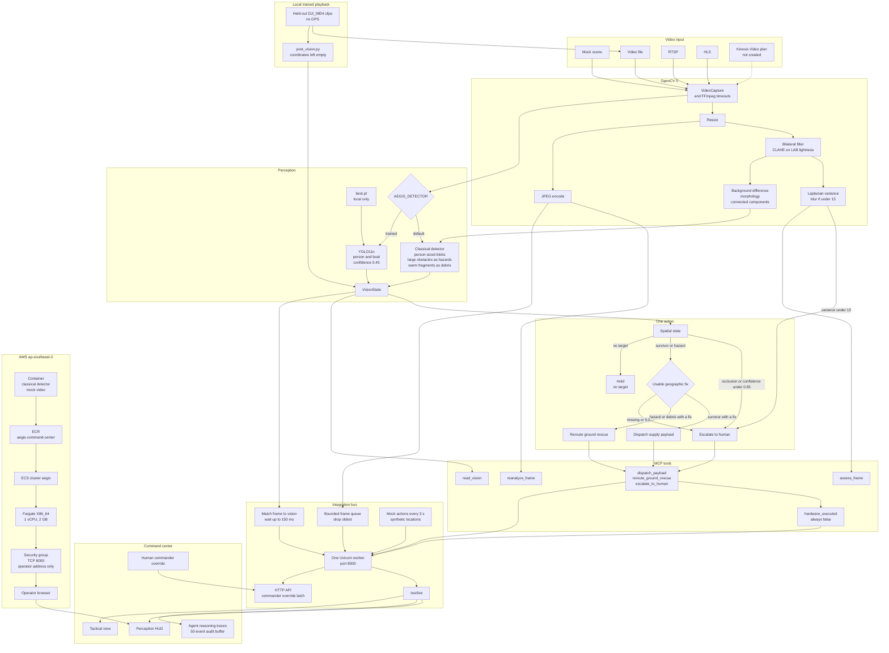

# Aegis architecture

```mermaid
flowchart TB
  subgraph input [Video input]
    direction LR
    mock[Mock scene]
    file[Video file]
    rtsp[RTSP]
    hls[HLS]
    kinesis[Kinesis Video plan<br/>not created]
  end

  subgraph opencv [OpenCV 5]
    direction LR
    capture[VideoCapture<br/>and FFmpeg timeouts]
    resize[Resize]
    prep[Bilateral filter<br/>CLAHE on LAB lightness]
    blur[Laplacian variance<br/>blur if under 15]
    segment[Background difference<br/>morphology<br/>connected components]
    jpeg[JPEG encode]
  end

  subgraph perception [Perception]
    direction LR
    choice{AEGIS_DETECTOR}
    classical[Classical detector<br/>person-sized blobs<br/>large obstacles as hazards<br/>warm fragments as debris]
    trained[YOLO11n<br/>person and boat<br/>confidence 0.45]
    weights[best.pt<br/>local only]
    vision[VisionState]
  end

  subgraph decision [One action]
    direction TB
    spatial[Spatial state]
    geo{Usable geographic fix}
    dispatch[Dispatch supply payload]
    reroute[Reroute ground rescue]
    escalate[Escalate to human]
    hold[Hold<br/>no target]
  end

  subgraph mcp [MCP tools]
    direction LR
    read[read_vision]
    assess[assess_frame]
    reanalyze[reanalyze_frame]
    act[dispatch_payload<br/>reroute_ground_rescue<br/>escalate_to_human]
    hardware[hardware_executed<br/>always false]
  end

  subgraph runtime [Integration bus]
    direction LR
    queue[Bounded frame queue<br/>drop oldest]
    worker[One Uvicorn worker<br/>port 8000]
    correlate[Match frame to vision<br/>wait up to 150 ms]
    live["/ws/live"]
    http[HTTP API<br/>commander override latch]
    mockActions[Mock actions every 3 s<br/>synthetic locations]
  end

  subgraph hud [Command center]
    direction LR
    feed[Perception HUD]
    traces[Agent reasoning traces<br/>50-event audit buffer]
    tactical[Tactical view]
    override[Human commander override]
  end

  subgraph localRun [Local trained playback]
    direction LR
    dji[Held-out DJI_0804 clips<br/>no GPS]
    post[post_vision.py<br/>coordinates left empty]
  end

  subgraph aws [AWS ap-southeast-2]
    direction LR
    image[Container<br/>classical detector<br/>mock video]
    ecr[ECR<br/>aegis-command-center]
    cluster[ECS cluster aegis]
    fargate[Fargate X86_64<br/>1 vCPU, 2 GB]
    guard[Security group<br/>TCP 8000<br/>operator address only]
    browser[Operator browser]
  end

  mock --> capture
  file --> capture
  rtsp --> capture
  hls --> capture
  kinesis -.-> capture
  capture --> resize --> prep
  prep --> blur
  prep --> segment
  resize --> jpeg
  segment --> classical
  capture --> choice
  choice -->|default| classical
  choice -->|trained| trained
  weights --> trained
  classical --> vision
  trained --> vision
  vision --> spatial
  blur -->|variance under 15| escalate
  spatial -->|occlusion or confidence under 0.65| escalate
  spatial -->|survivor or hazard| geo
  spatial -->|no target| hold
  geo -->|survivor with a fix| dispatch
  geo -->|hazard or debris with a fix| reroute
  geo -->|missing or 0,0| escalate
  vision --> read
  blur --> assess
  jpeg --> reanalyze
  dispatch --> act
  reroute --> act
  escalate --> act
  act --> hardware
  jpeg --> queue --> worker
  vision --> correlate --> worker
  act --> worker
  hardware --> worker
  mockActions --> worker
  worker --> live
  worker --> http
  live --> feed
  live --> traces
  live --> tactical
  override --> http
  dji --> file
  dji --> post --> vision
  image --> ecr --> cluster --> fargate --> guard --> browser
  browser --> feed
```
